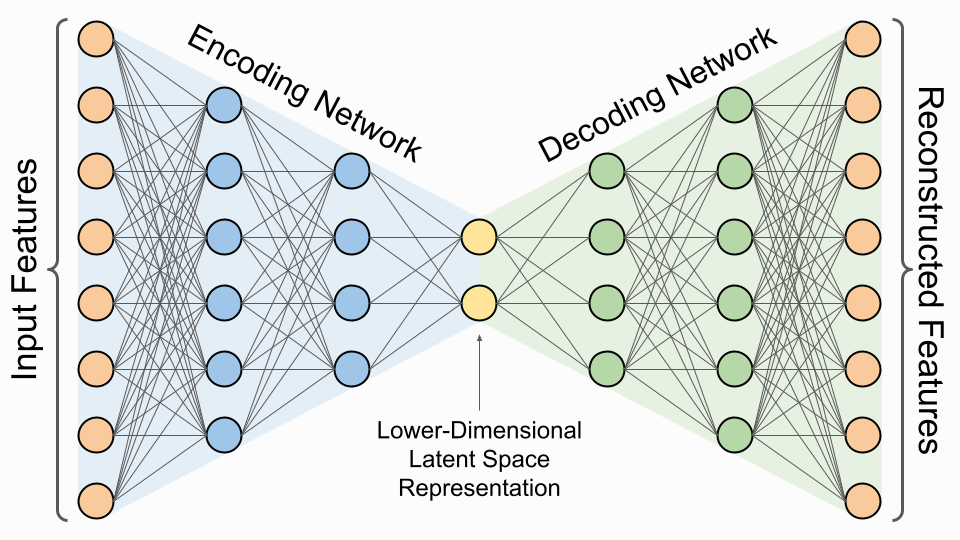

# Image features extraction: from Principal Components Analysis to Deep Autoencoders

### Author: Tomasz Hachaj

### Link to this presentation, source codes and data 

## Scope

We will discuss the application of PCA and autoencoder neural networks in cases where we want to perform feature extraction and analysis of image sets that:
- Contain images that are very similar to each other;
- Do not contain typical topologies (shapes) and objects that are well described by popular pretrained backbone models [link](https://keras.io/api/applications/);
- May not contain strictly defined object classes;
- Can be modeled using variance analysis.

## Real-life problem: CREDO dataset analysis

The Cosmic Ray Extremely Distributed Observatory (CREDO) Project is testing one of the many theories for what this dark matter could be – super massive particles born in the early Universe. If this theory is correct, we can't see the super massive particles themselves, but we should be able to detect what is left when these particles come to the end of their lives, or 'decay'. The very high energy photons predicted to result from this decay are unlike anything scientists have detected so far coming from outer space. This could be because they are very rare or, more likely, that they don't make it all the way across the Universe to the Earth without being affected by other particles.

From experiments with high energy particles carried out on the Earth we know that the interactions with other particles is likely to result in lots of lower energy photons being produced in a large 'cascade'. CREDO refers to these cascades as super-preshowers and they have the potential to be widely distributed across both space (an area larger than the Earth) and time (reaching different parts of the Earth at different times).

Source [link](https://credo.science/#/about/AboutCredo)

Source [link](https://arxiv.org/abs/2009.12314)

Currently, data available for analysis registered under CREDO infrastructure contain millions of events.

Locations of CREDO registered phone-based detectors. (2021)

Source [link](https://doi.org/10.3390/s21061963)

The analysis presented in this paper is based on the CREDO detection data set, as this is currently the largest publicly available data set of particle images obtained with mobile phones. The range of the CREDO worldwide device infrastructure is shown in above figure. Currently, the total number of registering devices is over 10,000 and is increasing.

The data is collected by devices equipped with CMOS cameras. Both the devices and cameras are of different types. The owners of the devices are often amateurs who participate voluntarily in accordance with the citizen science paradigm.The top picture shows a device we constructed for prototyping cosmic ray detection algorithms using a CMOS camera. It is based on a raspberry Pi microcomputer.In the bottom picture, a photo from the "Particle Hunters" workshop, the CREDO application runs on phones.

Source [link](https://doi.org/10.3390/s23104858)

Source [link](https://credo.science/#/posts/2023/03-31)

Access to data:

Examples of types of signals in the CREDO observation database:

Based on the morphology of objects visible in the images, the objects can be divided into four important groups: dots, tracks, worms, anomalous.

Low-energy, narrow, curly tracks are typical for electrons, high-energy, wide, straight tracks for energetic heavy charged particles such as protons.

A statistically verified hypothesis is that dots and dashes hint at muons, worms may be low-energy background particles, such as electrons, that lose energy in a CMOS array

On passage through the pixel, charged particles as well as gamma and x-rays affect CMOS/CCD sensors in a similar way as light does. If the camera cap is closed (or cell phone lens is well covered) so that the sensor is in the dark, the pixels affected, or hit, by a particle passage will produce a response as if they were exposed to light. If more than a single pixel is hit, a part of the particle track may be detected

Based on our experience gathered during the project, artifacts are most often caused by improper object coverage or exposure of the lens by a very strong light source.

## Principal Components Analysis

Based on [link](https://www.sthda.com/english/wiki/wiki.php?id_contents=7851).

Principal component analysis (PCA) allows us to summarize the variations (informations) in a data set described by multiple variables. Each variable could be considered as a different dimension. If you have more than 3 variables in your data sets, it could be very difficult to visualize a multi-dimensional hyperspace.

The goal of principal component analysis is to transform the initial variables into a new set of variables which explain the variation in the data. These new variables corresponds to a linear combination of the originals and are called principal components.

PCA reduces the dimensionality of multivariate data, to two or three that can be visualized graphically with minimal loss of information.

### Covariance analysis

Example numerical dataset (decathlon):

Source: [link](https://www.sthda.com/english/wiki/wiki.php?id_contents=7851)

Covariance analysis:

Source: [link](https://www.sthda.com/english/wiki/wiki.php?id_contents=7851)

Correlation between strength training and high jumps [link](https://www.youtube.com/watch?v=4qKY6JLm-3s) :-)

### Dimensionality reduction

Variance explained:

Source: [link](https://www.sthda.com/english/wiki/wiki.php?id_contents=7851)

PCA loadings are coefficients that indicate the contribution of each original variable to a principal component, representing the correlation between the original variables and the principal components. Below image presents loadings plot. Loading plots also hint at how variables correlate with one another: a small angle implies positive correlation, a large one suggests negative correlation, and a 90° angle indicates no correlation between two characteristics. 

Source: [link](https://www.sthda.com/english/wiki/wiki.php?id_contents=7851)

### Features extraction: Eigenfaces - intuitive interpretation of applying PCA on image data

Eigenface is $k$-dimensional vector of real values that represents features of pre-aligned facial image. Eigenfaces are based on principal components analysis (PCA). Let us suppose that we have a set of $l$ images $[I_1, I_2, \ldots ,I_l]$ with uniform dimensionality $m \times n$. Each face image being initially a two-dimensional matrix is ``flattened'' by placing its columns one below another, thereby becoming a single column vector. Then we use PCA to perform variance analysis and to recalculate current coordinates of those vectors into PCA coordinates systems where axes are ordered from those that represent highest variance to those that represent lowest variance. Let us assume that we have matrix 
$D$ 
with dimensionality $(n\cdot m) \times l$ in which each column is a flattened image:

$D_{[n\cdot m,l]}=[I_{1}, I_{2},\ldots,I_{l}]$

Next we calculate a column vector $M$ (so called mean face) in which each row is a mean value of a corresponding row in matrix $D$. This mean face is then subtracted from each column of matrix $D$ to calculate new matrix called $D'$:

$D'_{[n\cdot m,l]}=[I_{1}-M,I_{2}-M,\ldots,I_{l}-M]$

Then a covariance matrix is created:

$C_{[l,l]}= \frac{1}{l} \cdot D'^{T}_{[n\cdot m,l]}\cdot D'_{[n\cdot m,l]}$

Because $C$ is symmetric and positively defined, all eigenvalues have real positive values. Eigenfaces $E$ are calculated as:

$E_{[n\cdot m,l]}= D'_{[n\cdot m,l]}\cdot E_{C[l,l]}$

where $E_C$ are eigenvectors of $C$ ordered from the highest to the lowest eigenvalue.

In order to generate eigenfaces-based features $e_{i}$ of face image $I_{i}$ one has to perform following operation:

$e_{i}= E^{T}_{[n\cdot m,l]} \cdot {(I_{i} - M)}$

The inverse procedure that recalculates image vector coordinates to original coordinate system is:

$I'_{i}= (E_{[n\cdot m,l]} \cdot e_{i}) +  M$

We can use $k$ first eigenvectors where $k < l$. In this case $I_{i} \approx I'_{i}$ and $I'_{i}$ keeps at least percentage of variance equals to scaled cumulative sum of eigenvalues cooresponding to $k$ first eigenvectors. In other words when $k < l$, vector $I'_{i}$ represents ``compressed'' facial image 
$ I_{i} $ in respect to overall variance. $e_{i}$ features are coefficients of linear combination of $E$. Coefficients with lower indices corresponds to dimensions with higher variance.

Source [link](https://www.mdpi.com/1099-4300/23/3/273)

Run below source code to examine influence of coefficients on image reconstruction.

[GUIeigenOpenCVv2.py](GUIeigenOpenCVv2.py)

### CREDO dataset - Image aligning

Image aligning might improve results of further image analysis. In case of CREDO dataset, the aligning is based on translating images so that the pixels with the highest grayscale intensity will be in the center of the image, and rotating images so that the brightest collinear pixels will be horizontal. This type of alignment might be done with the aid of PCA. The proposed aligning algorithm works as follows:

- Input image is converted to grayscale;
- PCA is computed on a dataset constructed from pixels of grayscale image. Each pixel has its coordinate in the image. If the pixel is black (has value equals 0) its coordinates are not included in the dataset. If the pixel has a value greater than zero, we add to the dataset as many points with coordinates of that pixel as the value of that pixel (from 1 to 255). This means that the brighter the pixel is, the more data it appends to the dataset from which the PCA is calculated;
- Most significant PCA axis is used to rotate image while dataset mean is used to translate image;
- After image rotation and translation result image is cropped to original size of input image.

Source [link](https://www.mdpi.com/1424-8220/24/6/1835)

Example results:

### Finding similar images

The procedure of finding k most similar objects to $I_j$ requires calculating distance between embedding of this object and embedding of each other object and ordering them in descending order. Objects corresponding to first k the smallest distances indicate most similar objects. 

$Dist(𝐸_j)=[(d(E_1,E_j),E_1),...,(d(E_i,E_j),E_i),...,(d(E_n,E_j),E_n)] order by (E_i,E_j)$

where $Dist(E_j)$ is ordered list of pairs, each pair contains distance between $E_j$ and certain element from the dataset.

Source [link](https://www.mdpi.com/1424-8220/24/6/1835#B101-sensors-24-01835)

### Finding anomalies

After applying PCA and dimensions reduction we can use a new obtained embedding (latent) space to examine similarity between objects. We can define an anomaly as an object that is not similar to other objects in the dataset in terms of distance between objects embedding. According to this definition outliers might be considered as anomalies. In order to detect outliers we can apply certain cluster analysis algorithm like agglomerative clustering, DBSCAN or even k-means. In case of first two algorithms in order to optimize performance it is required to calculate distance matrix between objects in the dataset which might be difficult or hardly possible in case of big data. In our case we do not need to find the answer to which cluster a certain objects belongs, rather if a certain object is outlier. Knowing this we can adapt the anomalies searching approach derived from the DBSCAN: an object $I_j$ with embedding $E_j$ is an outlier when in its neighbourhood with radius $\epsilon$ there are less than k other objects. The anomalies set A can be defined as:

$I_{j} \in A \Leftrightarrow  \#\{I_{i}:d(E_{j},E_{i})<\epsilon, i \in [1..n]\} < k$

Where $\#$ is cardinal number of the set and $\{I_{i}:d(E_{j},E_{i})<\epsilon, i \in [1..n]\}$ is a set of object in whole dataset which distance  between their embedding and embedding of $I_{j}$ is less than $\epsilon$ and d is a distance function (in our case Euclidean distance).

Source [link](https://www.mdpi.com/1424-8220/24/6/1835)

Run below source code to test CREDO dataset analysis using PCA-based embedding:

[CREDO_PCA.ipynb](CREDO_PCA.ipynb)

### Incremental Principal Components Analysis: eigendecompostion on large dataset

If cosmic ray particle images are acquired continuously, the embedding calculation will have to be repeated from time to time, for example, when a new large enough batch of data is collected. In order to reduce the number of necessary calculations, the step of determining PCA with a basic algorithm, for example, based on SVD, can be replaced by approximation of PCA by Incremental PCA algorithm.

In order to reduce the memory and computational complexity of the algorithm finding image embedding, one can use PCA approximation based on incremental calculation of PCA with, for example, the algorithm proposed in the paper [link](https://link.springer.com/article/10.1007/s11263-007-0075-7). That algorithm is an extension of the Sequential Karhunen-Loeve Transform [link](https://ieeexplore.ieee.org/document/855432). A mean update is calculated according to a Youngs and Cramer variance update procedure [link](https://www.tandfonline.com/doi/abs/10.1080/00031305.1983.10483115),

We can evaluate how similar is PCA-generated coordinate system to PCA coordinate system approximated by incremental PCA. The comparison of coordinate systems can be done using coordinate frames weighted distance (cfd):

$cfd((V_{1},\overline{\lambda_{1}}),(V_{2},\overline{\lambda_{2}}))=\sum_{i=1}^{d} \frac{\overline{\lambda_{1,i}} + \overline{\lambda_{2,i}}}{2}\measuredangle (sc(V_{1,i}), sc(V_{2,i}))$

Where $(V_{1},\overline{\lambda_{1}})$ is eigenvectors matrix and eigenvalues vector of first PCA, $(V_{2},\overline{\lambda_{2}})$ is eigenvectors matrix and eigenvalues vector of second PCA, $(V_{1,i}, \lambda_{1,i})$ is i-th eigenvector and i-th eigenvalue of first PCA, sc is a sign correction. Note that all eigenvalues of PCA are non-negative; cfd is measured in radians (rad).

Run below source code to test Comparision of PCA and PCA incremental PCA:

[CREDO_incremental_PCA.ipynb](CREDO_incremental_PCA.ipynb)

## Autoencoders

Section based on [link](https://blog.keras.io/building-autoencoders-in-keras.html)

Autoencoders are a class of Neural Network architectures that learn an encoding function, which maps an input to a compressed latent space representation, and a decoding function, which maps from the latent space back into the original space. Ideally, these functions are pure inverses of each other - passing data through the encoder and then passing the result through the decoder perfectly reconstructs the original data in what is called lossless compression.

Autoencoding is a data compression algorithm where the compression and decompression functions are 1) data-specific, 2) lossy, and 3) learned automatically from examples rather than engineered by a human. Additionally, in almost all contexts where the term "autoencoder" is used, the compression and decompression functions are implemented with neural networks.

1) Autoencoders are data-specific, which means that they will only be able to compress data similar to what they have been trained on. This is different from, say, the MPEG-2 Audio Layer III (MP3) compression algorithm, which only holds assumptions about "sound" in general, but not about specific types of sounds. An autoencoder trained on pictures of faces would do a rather poor job of compressing pictures of trees, because the features it would learn would be face-specific.

2) Autoencoders are lossy, which means that the decompressed outputs will be degraded compared to the original inputs (similar to MP3 or JPEG compression). This differs from lossless arithmetic compression.

3) Autoencoders are learned automatically from data examples, which is a useful property: it means that it is easy to train specialized instances of the algorithm that will perform well on a specific type of input. It doesn't require any new engineering, just appropriate training data.

Source [link](https://www.assemblyai.com/blog/introduction-to-variational-autoencoders-using-keras)

Run below source code to examine CREDO dataset analysis using deep autoencoder-based embedding:

[CREDO_deep_autoencoder.ipynb](CREDO_deep_autoencoder.ipynb)

## Convolutional Autoencoders

Since our inputs are images, it makes sense to use convolutional neural networks (convnets) as encoders and decoders. The encoder will consist in a stack of Conv2D and MaxPooling2D layers (max pooling being used for spatial down-sampling), while the decoder will consist in a stack of Conv2D and UpSampling2D layers.

Run below source code to examine CREDO dataset analysis using deep convolutional autoencoder-based embedding:

[CREDO_convolutional_autoencoder.ipynb](CREDO_convolutional_autoencoder.ipynb)

MG and V - Determination of spherical coordinates - revision

## Incorporation of PCA and autoencoder for features extraction and denoising

The signatures of CRE (Cosmic rays ensembles) might be spread over very large areas, as illustrated in figure below, and this feature might make them all but impossible to detect by existing detector systems operating in isolation. On the other hand, if the active detectors operate as part of a global network, as proposed by The Cosmic-Ray Extremely Distributed Observatory (CREDO) these CRE are naturally more likely to be observed.

Depending on the angle at which a burst of radiation falls on the ground on the surface of the earth, particle distributions with different distributions are observed. In practice, we do not observe the entire distribution but only its sampled values at points where the detectors are located.

Source: [link](https://mgv.sggw.edu.pl/article/view/5248)

Ultra-high energy cosmic ray (UHECR) with unknown spherical coordinates generates a jet that is observed on Earth surface by the detectors. Data registered by detectors is sampled and mixed with background radiation (noise). After applying Gaussian filtering, deep encoder-decoder network reconstruct the original jet and below algorithm is used to calculate spherical coordinates of cosmic ray flux distribution.

Examples of above algorithm results  for $(\theta=62, \phi=85)$. Estimation of these angles for Img (800x800) equals $(\theta=62.64, phi=85.15)$, for Img convoluted by Gaussian is $(\theta=60.96, \phi=85.38)$, for Img convoluted by Gaussian and resampled to 80x80 is $(\theta=60.77, \phi=85.21)$ for sampled ${Img_d}$ convoluted by Gaussian (800x800) is $(\theta=50.17, \phi=84.34)$, for sampled ${Img_d}$ convoluted by Gaussian and resampled to 80x80 is $(\theta=49.43, \phi=84.19)$, for sampled ${Img_d}$ convoluted by Gaussian resampled to 80x80 and processed by E-D is $(\theta=56.55, \phi=84.84)$

Source: [link](https://mgv.sggw.edu.pl/article/view/5248)

Examples of above Algorithm results  for $(\theta=76, \phi=170)$. Estimation of these angles for Img (800x800) equals $(\theta=75.87, phi=169.54)$, for Img convoluted by Gaussian is $(\theta=72.96, phi=169.85)$, for Img convoluted by Gaussian and resampled to 80x80 is $(\theta=72.85, \phi=169.81)$ for sampled ${Img_d}$ convoluted by Gaussian (800x800) is $(\theta=57.13, \phi=169.97)$, for sampled ${Img_d}$ convoluted by Gaussian and resampled to 80x80 is $(\theta=57.04, \phi=170.01)$, for sampled ${Img_d}$ convoluted by Gaussian resampled to 80x80 and processed by E-D is $(\theta=72.00, \phi=173.06)$.

Source: [link](https://mgv.sggw.edu.pl/article/view/5248)

## Aditional source codes

[Determination of spherical coordinates of sampled cosmic ray flux distribution using Principal Components Analysis and Deep Encoder-Decoder Network](https://github.com/browarsoftware/cosmic_ray_spherical)

[CREDO image search engine](https://github.com/browarsoftware/cise)

[On the Search for Potentially Anomalous Traces of Cosmic Ray Particles in Images Acquired by Cmos Detectors for a Continuous Stream of Emerging Observational Data ](https://github.com/browarsoftware/anomalies_bigdata)

[Eigenfaces-Based Steganography](https://github.com/browarsoftware/EigenfacesSteganography)

## Interesting problems

- Examine the stability of deep autoencoders and convolutional autoencoders with a fixed network topology: are the anomalies found for the CREDO dataset identical? How much do they differ from each other?
- Examine the stability of deep autoencoders for different bottleneck sizes: are the anomalies found for the CREDO dataset identical? How much do they differ from each other?

## References

[FactoMineR and factoextra : Principal Component Analysis Visualization - R software and data mining](https://www.sthda.com/english/wiki/wiki.php?id_contents=7851)

[CREDO science website](https://credo.science/)

[Introduction to Variational Autoencoders Using Keras](https://www.assemblyai.com/blog/introduction-to-variational-autoencoders-using-keras)

[Hachaj et. al, Towards detection of anomalous cosmic ray signals for observations acquired from Cosmic Ray Extremely Distributed Observatory mobile detectors](https://www.sciencedirect.com/science/article/abs/pii/S0952197625021177)

[Piekarczyk, M.; Hachaj, T. On the Search for Potentially Anomalous Traces of Cosmic Ray Particles in Images Acquired by Cmos Detectors for a Continuous Stream of Emerging Observational Data. Sensors 2024, 24, 1835. https://doi.org/10.3390/s24061835](https://www.mdpi.com/1424-8220/24/6/1835)

[Hachaj, Tomasz, Katarzyna Koptyra, and Marek R. Ogiela. 2021. "Eigenfaces-Based Steganography" Entropy 23, no. 3: 273. https://doi.org/10.3390/e23030273 ](https://www.mdpi.com/1099-4300/23/3/273)

[Hachaj, T., Piekarczyk, M., Bibrzycki, Ł., & Wąs, J. (2024). Determination of spherical coordinates of sampled cosmic ray flux distribution using Principal Components Analysis and deep Encoder-Decoder network. Machine Graphics & Vision, 33(2), 29–45. https://doi.org/10.22630/MGV.2024.33.2.2](https://mgv.sggw.edu.pl/article/view/5248)

[Hachaj T, Piekarczyk M. The Practice of Detecting Potential Cosmic Rays Using CMOS Cameras: Hardware and Algorithms. Sensors. 2023; 23(10):4858. https://doi.org/10.3390/s23104858 ](https://www.mdpi.com/1424-8220/23/10/4858)

[Chan, T. F., Golub, G. H., & Leveque, R. J. (1983). Algorithms for Computing the Sample Variance: Analysis and Recommendations. The American Statistician, 37(3), 242–247. https://doi.org/10.1080/00031305.1983.10483115](https://www.tandfonline.com/doi/abs/10.1080/00031305.1983.10483115)

[A. Levey and M. Lindenbaum, "Sequential Karhunen-Loeve basis extraction and its application to images," in IEEE Transactions on Image Processing, vol. 9, no. 8, pp. 1371-1374, Aug. 2000, doi: 10.1109/83.855432.](https://ieeexplore.ieee.org/document/855432)

[Ross, D.A., Lim, J., Lin, RS. et al. Incremental Learning for Robust Visual Tracking. Int J Comput Vis 77, 125–141 (2008). https://doi.org/10.1007/s11263-007-0075-7](https://link.springer.com/article/10.1007/s11263-007-0075-7)

[CREDO project paper](https://arxiv.org/abs/2009.12314)

[Hachaj, Tomasz, Łukasz Bibrzycki, and Marcin Piekarczyk. 2021. "Recognition of Cosmic Ray Images Obtained from CMOS Sensors Used in Mobile Phones by Approximation of Uncertain Class Assignment with Deep Convolutional Neural Network" Sensors 21, no. 6: 1963. https://doi.org/10.3390/s21061963 ](https://www.mdpi.com/1424-8220/21/6/1963)

[Building Autoencoders in Keras](https://blog.keras.io/building-autoencoders-in-keras.html)

[Tomasz Hachaj, Łukasz Bibrzycki; Marcin Piekarczyk; Olaf Bar; Michał Niedźwiecki; Sławomir Stuglik; Piotr Homola; Dmitriy Beznosko; David Alvarez-Castillo; Bożena Poncyljusz; Ophir Ruimi; Oleksandr Sushchov; Krzysztof Rzecki, "Towards detection of anomalous cosmic ray signals for observations acquired from Cosmic Ray Extremely Distributed Observatory mobile detectors", in press]()
