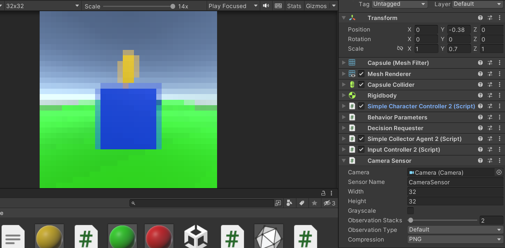
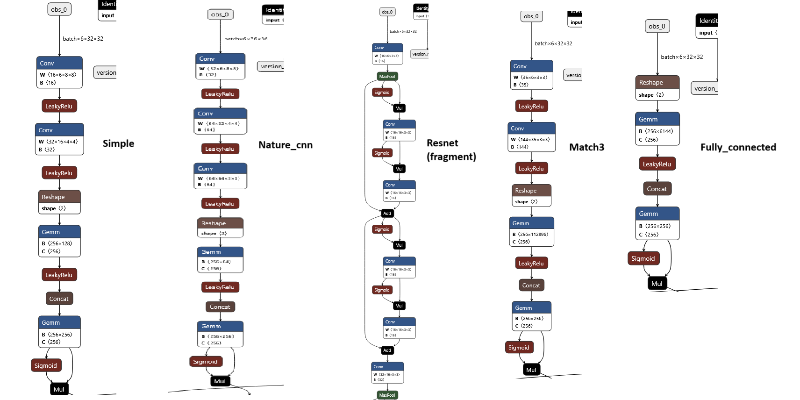
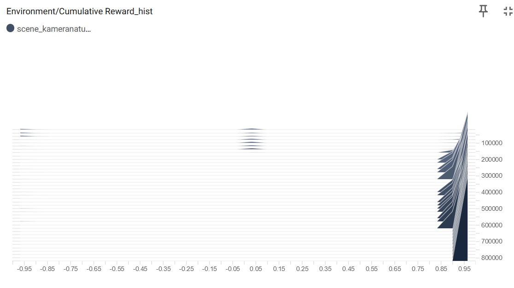
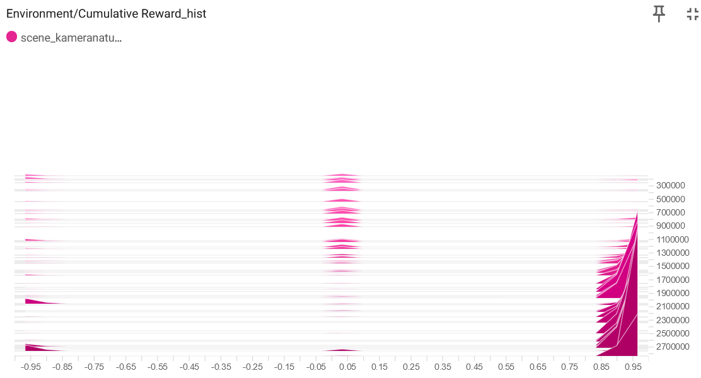
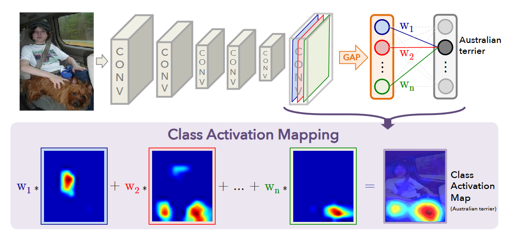

# Application of reinforcement learning in agent-based modelling-Machine learning in 3D Unity environment

### Author: Tomasz Hachaj

### Link to this presentation 


## Scope

In this lecture, we will remind the basics of reinforcement learning and how to prepare a training environment for agents in Unity. We will use a virtual distance sensor and a virtual vision sensor (camera). We will explain the neural network that controls the ML agent using the Grad-CAM algorithm and CART (Classification And Regression Tree).

The approach we will discuss is worth using when:
- We want to prototype and test machine learning algorithms based on reinforcement learning in a 3D environment;
- We accept simplifications and numerical errors in the simulation of physical laws that occur in graphics game engines.


Source codes for explanation of  machine learning agents trained with Proximal Policy Optimization that utilizes visual sensor data can be found here: [link](https://github.com/browarsoftware/ppo_explanation)

# Reinforcement learning

Reinforcement learning (RL) is a paradigm of learning algorithms based on the reward function received for performing a defined action. The RL paradigm differs from supervised and unsupervised learning paradigms in that it typically does not use a training set (either labeled or unlabeled). Basic versions of RL algorithms are based on a finite state machine, which is used in the process of optimizing a reward-based objective function. RL largely uses methodology known from stochastic process analysis.


Agent interaction with the environment, source [link](https://link.springer.com/book/10.1007/978-1-4842-6503-1).

The environment is sometimes also referred to as the world. The agent resides in the environment and interacts with it by taking actions. The agent is rewarded based on the current state of the environment (its actions can modify the state of the environment). The agent's goal is to maximize the cumulative reward function (the sum of the rewards earned during its interaction with the environment). The goal of RL is to maximize the value of this reward.

The goal of RL is to select a strategy that maximizes the value of the cumulative reward function when the agent performs actions in accordance with that strategy (in other words, the expected value of the reward).

## Proximal Policy Optimization (PPO)

RL algorithms are divided into many classes. If the agent has access to (or learns) a model of the environment, then we are dealing with model-based algorithms. If the agent does not have access to (does not learn) a model of the environment, the algorithm is model-free. 

Within model-free algorithms, Q-Learning approaches are popular, in which the approximation $Q_{\theta}(s,a)$ (the value of the action-state pair function (On-Policy Action-Value Function)) and strategy optimization (Policy Optimization) are calculated.


Image source [link](https://spinningup.openai.com/en/latest/spinningup/rl_intro2.html)

In algorithms from the policy optimization group, parameters of neural network $\phi$ are learned directly by the gradient algorithm based on the largest gradient increase (gradient ascent) relative to $J(\pi_{\theta})$ (the expected value of the strategy $\pi$) or its local approximation.

This optimization is almost always performed based on the value of the state function, so that each update uses only data collected during operation according to the latest state. State optimization usually also involves learning the approximator $V_{\phi}(s)$, which is used to determine how to update the state (s is a state).

The PPO-clip algorithm (the base algorithm used in OpenAI) updates the strategy according to the equation:

$\theta_{k+1} = \arg \max_{\theta} \underset{s,a \sim \pi_{\theta_k}}{{\mathrm E}}\left[ L(s,a,\theta_k, \theta)\right]$

where:

$L(s,a,\theta_k,\theta) = \min\left( \frac{\pi_{\theta}(a|s)}{\pi_{\theta_k}(a|s)} A^{\pi_{\theta_k}}(s,a), \;\; \text{clip}\left(\frac{\pi_{\theta}(a|s)}{\pi_{\theta_k}(a|s)}, 1 - \epsilon, 1+\epsilon \right) A^{\pi_{\theta_k}}(s,a) \right)$, $a$ is an action.

and:

$A^{\pi}(s,a) = Q^{\pi}(s,a) - V^{\pi}(s)$

The function $A^{\pi}(s,a)$ corresponding to policy $\pi$ describes how much better it is to take a specific action a in state s than to randomly select an action according to $\pi(\cdot|s)$, assuming that we will continue to act according to strategy $\pi$. 

The clip function limits the possibility of changing the expected value of the policy to the interval $[1 - \epsilon, 1+\epsilon ]A^{\pi_{\theta_k}}(s,a)$.

Other materials worth reading: [link1](https://spinningup.openai.com/en/latest/spinningup/rl_intro3.html), [link2](https://unity-technologies.github.io/ml-agents/Training-Configuration-File/#ppo-specific-configurations), [link3](https://www.gocoder.one/blog/training-agents-using-ppo-with-unity-ml-agents/).

## Using RL in the Unity environment

### Configuring the Python and Unity environment

Installation: Windows 11 OS / macOS X 11+ / Ubuntu 24.04, Unity 2021.3.18f1+, Python 3.9, torch 2.2.2, numpy 1.23.5, mlagents-envs 0.3, mlagents 0.3, onnx 1.16.2 (downgrade protobuf to version 3.20.0!). The version presented here is different from [Al-agents Installation](https://github.com/Unity-Technologies/ml-agents/blob/main/docs/Installation.md), but it works :-)

To test if the installation works, run (in the Python environment installation directory):

```cs

Scripts/mlagents-learn

```

Assuming that the examples are located in the c:\projects\unity\ml-agents-develop directory, to run the network training from the 3DBall example (
c:\projects\unity\ml-agents-develop\Project\Assets\ML-Agents\Examples\3DBall), run

```cs

mlagents-learn.exe c:\projects\unity\ml-agents-develop\config\ppo\3DBall.yaml  --run-id=first3DBallRun

```

An explanation of the contents of the yaml file is provided below.

```cs
behaviors:
  3DBall:
    trainer_type: ppo   - optimization algorithm
    hyperparameters:
      batch_size: 64    
      buffer_size: 12000    - Number of traials to be gathered before updating the policy model
      learning_rate: 0.0003 - see: https://pathak22.github.io/noreward-rl/resources/icml17.pdf
      beta: 0.001 - see: https://paperswithcode.com/method/entropy-regularization
      epsilon: 0.2  - This affects how quickly policy can evolve during training (see clip function).
      lambd: 0.99 - see: https://arxiv.org/abs/1506.02438
      num_epoch: 3 - The number of passes through the trial buffer when performing gradient optimization. Reducing this value will ensure more stable updates at the expense of slower learning.
      learning_rate_schedule: linear - Specifies how the learning rate changes over time. Linear decreases the learning rate linearly, reaching 0 at max_steps, while constant keeps the learning rate constant throughout the training.
    network_settings:
      normalize: true - Is normalization applied to the vector input data of observations?
      hidden_units: 128 - The number of units in the hidden layers of a neural network.
      num_layers: 2 - The number of hidden layers in a neural network.
      vis_encode_type: simple -  Type of encoder for encoding visual observations (simple are two convolutional layers).
    reward_signals:
      extrinsic:
        gamma: 0.99 - Discount factor
        strength: 1.0 - see: https://pathak22.github.io/noreward-rl/resources/icml17.pdf
    keep_checkpoints: 5
    max_steps: 500000 - The total number of steps (i.e., observations collected and actions taken) that must be performed in the environment before the learning process is complete.
    time_horizon: 1000 - How many trial steps should be collected for an agent before adding it to the experience buffer?
    summary_freq: 12000 - The number of trials that must be collected before training statistics can be generated and displayed.
```

A full description of the parameters can be found here: [link](https://unity-technologies.github.io/ml-agents/Training-Configuration-File/#ppo-specific-configurations).

The Python distribution's Scripts directory includes Tensorboard, which we can use to visualize the training results.

```cs

tensorboard --logdir results --port 6006


```

Then open your browser:

```cs

http://localhost:6006

```

More about Tensorboard: [link](https://unity-technologies.github.io/ml-agents/Using-Tensorboard/).


### Configuring the experiment from scratch - agent following the ball

Goal: the agent must find the ball and move toward it until it collides with it. The agent cannot collide with walls. The agent can move along the X and Z axes.

1. Create a new Unity project and install the ML Agents package (Window->Package Manager->Unity Registry)


2. We create a simulation environment. The scene consists of a “box” in which the agent will move (not too large, e.g., 5x5). We add tags to the walls of the box (e.g., “wall”), add a ball (we give it the tag ‘target’) and a cube, which will be the agent (we give it the tag “agent”).


We place all these elements as child elements of an empty game object. We do this because the training will use multiple instances of this prefab to speed up learning. The prefab will be created later.

3. We create the AgentScript.cs script, which we then add to the Agent game object (cube). We change the class inheritance in the script from GameObject to Agent.

```cs

using System.Collections;
using System.Collections.Generic;
using UnityEngine;
using Unity.MLAgents;
using Unity.MLAgents.Actuators;
using Unity.MLAgents.Sensors;
using UnityEngine.Analytics;

// Based on:
// https://www.youtube.com/watch?v=WgOGGnGdHeI
public class AgentScript : Agent
{
}


```

4. Add a RigidBody to the agent object and set the Is Trigger value on the sphere's Collider. This is to enable collision detection with other colliders using the “OnTriggerEnter” event.

In the Behaviour Parameters section, set the space size to 6 (we will observe two 3D vectors) and Continous Actions to 2 (two float values responsible for movement along the X and Z axes).

If Behaviour Type is set to default, the agent is controlled using a network (Model) and the agent control model can be trained. If Behaviour Type is set to Heuristic Only, the agent is controlled using the public override void Heuristic (in ActionBuffers actionsOut) method, which can be found in the agent script.

Add the DecisionRequester script to the agent object. The DecisionRequester component requests the Agent instance to make decisions at regular intervals.


5. Next we implement script AgentScript.cs

```cs

using System.Collections;
using System.Collections.Generic;
using UnityEngine;
using Unity.MLAgents;
using Unity.MLAgents.Actuators;
using Unity.MLAgents.Sensors;
using UnityEngine.Analytics;

// Based on
// https://www.youtube.com/watch?v=WgOGGnGdHeI
public class AgentScript : Agent
{
    [SerializeField] private Transform target;
    [SerializeField] private float moveSpeed = 2.0f;
    // the maximum number of moves made by the agent; if it does not reach the goal after making these moves, the attempt ends in failure
    [SerializeField] private int maxSteps = 1000;
    // number of moves made in a given iteration of the agent learning process
    private int steps = 0;
    // initiating the random position of the agent and the target, we assume that it is a random vector [rand[-4, 4], 0, rand[-4, 4]]
    private void setRandomPosition()
    {
        target.transform.localPosition = new Vector3(8f * Random.value -4f,0, 8f * Random.value -4f);
        transform.localPosition = new Vector3(8f * Random.value -4f,0, 8f * Random.value -4f);
    }
    // a method performed at the beginning of each iteration (episode) of the agent training process
    public override void OnEpisodeBegin()
    {
        steps = 0;
        setRandomPosition();
    }
    // data collection from the environment, observations will be used in the agent learning process
    public override void CollectObservations(VectorSensor sensor)
    {
        // We store two vectors, a total of 6 float variables.
        sensor.AddObservation(transform.localPosition);
        sensor.AddObservation(target.localPosition);
    }
    // a method performed both during the learning process and during agent operation - interprets the model's response by translating it into agent movement
    public override void OnActionReceived(ActionBuffers actionBuffers)
    {
        // retrieving responses from the model, 2 float variables
        float x = actionBuffers.ContinuousActions[0];
        float z = actionBuffers.ContinuousActions[1];
        // counting the displacement and modifying the position of the object
        Vector3 velocity = new Vector3(x, 0, z).normalized * moveSpeed * Time.deltaTime;
        transform.localPosition += velocity;
        steps++;
        // Each movement is penalized by a value of -0.01f.
        AddReward(-0.01f);
        // if we fail to reach the destination after the set number of steps, we end the iteration with an additional penalty of -1
        if (steps >= maxSteps)
        {
            AddReward(-1f);
            EndEpisode();
        }
    }
    // Instead of the agent-driven model, we can use the following heuristic, which retrieves data from the user.
    // For it to work, set Behaviour Type to Heuristic only!
    public override void Heuristic(in ActionBuffers actionsOut)
    {
        ActionSegment<float> ca = actionsOut.ContinuousActions;
        ca[0] = Input.GetAxisRaw("Horizontal");
        ca[1] = Input.GetAxisRaw("Vertical");
    }

    // In the event of a collision with an object, if the object is the target, we receive a reward.
    // if it's a wall, we get a penalty
    private void OnTriggerEnter(Collider other)
    {
        Debug.Log(other.gameObject.tag);
        if (other.gameObject.tag == "target")
        {
            AddReward(4f);
            EndEpisode();
        }
        if (other.gameObject.tag == "wall")
        {
            AddReward(-1f);
            EndEpisode();
        }
    }
}


```

6. We duplicate the environment in which the agent is located multiple times.


We start the training process in the directory where we have the executable files of the Python environment we have configured.

```cs

mlagents-learn.exe --run-id=prostascena1


```

Let's assume that we have the following script prosta_scena.yaml located in the Scripts directory:

```cs

behaviors:
  SimpleCollector:
    trainer_type: ppo
    hyperparameters:
      batch_size: 64
      buffer_size: 12000
      learning_rate: 0.0003
      beta: 0.001
      epsilon: 0.2
      lambd: 0.99
      num_epoch: 3
      learning_rate_schedule: linear
    network_settings:
      normalize: true
      hidden_units: 128
      num_layers: 2
      vis_encode_type: simple
    reward_signals:
      extrinsic:
        gamma: 0.99
        strength: 1.0
    keep_checkpoints: 5
    max_steps: 1000000
    time_horizon: 1000
    summary_freq: 12000


```

SimpleCollector is the name entered in the Agent Behavior Name field in Unity.

For the file prosta_scena.yaml, training is started with the command:

```cs

mlagents-learn.exe prosta_scena.yaml --run-id=prostascena1

```

The training results will be located in the results/prostascena1 subdirectory.

Launch the game in Unity (agents must have Behaviour Type set to Default!). Wait patiently until the training is complete. Once it is complete, you can set the resulting onnx network file as a model for the agent and test its operation.

To see the training statistics, run tensorboard:

```cs

tensorboard --logdir results --port 6006

```

and see the results in your browser:

```cs

http://localhost:6006

```


The ONNX format network generated for this example can be viewed using the netron tool, for example [link](https://netron.app/).


According to our definition, the network consists of two hidden layers using a sigmoid activation function. The network has two outputs: deterministic_continous_actions and continous_actions. deterministic_continous_actions returns the action vector with the highest probability resulting from the previous approximation. continous_actions additionally adds a random factor consistent with the normal distribution. This is because the PPO strategy is stochastic and its goal is to determine probabilities and take samples according to those probabilities (more at [link](https://github.com/Unity-Technologies/ml-agents/issues/2112)).

ONNX operators can be seen here [link](https://onnx.ai/onnx/operators/index.html).


# Distance sensor (Ray perception sensor 3D)

performs a similar role to an ultrasonic distance sensor or LIDAR in the real world. Both devices (which, of course, operate on different physical principles) are designed to estimate the distance to objects in the agent's environment. 

The ultrasonic sensor is a very commonly used component in robotics, allowing for the detection of obstacles that may be in the agent's path.

LIDAR (Light Detection and Ranging, usually much more expensive than an ultrasonic sensor) is typically mounted on a movable head in robotics tasks and allows for 360-degree observation of the environment. LIDAR is often a source of data for SLAM [link](https://www.cvlibs.net/datasets/kitti/eval_odometry.php) and odometry (a branch of measurement that deals with distance measurement) algorithms.


Example of an ultrasonic sensor, source [link](https://botland.com.pl/czujniki-odleglosci/14329-ultradzwiekowy-czujnik-odleglosci-2-400cm-hy-srf05-5903351241588.html)


Example of LIDAR, source [link](https://botland.com.pl/skanery-laserowe/19625-skaner-laserowy-rplidar-a1m8-r6-360-stopni-12m-seeedstudio-114992561-5904422369248.html?cd=20567593583&ad=&kd=&gad_source=1&gclid=CjwKCAjw_4S3BhAAEiwA_64YhpLqHTwS3NTcq0nTkmB6K-9HrSU9a49dVMP3uNmwEIseip1Ez0EaYhoCNn0QAvD_BwE)

Of course, it is important to be aware that measurements taken using ultrasonic sensors and LIDARs are subject to various measurement errors resulting, among other things, from the influence of the natural environment. One of the most difficult issues in robotics is accurately estimating the position of an agent over time, which has a significant impact on environment mapping – even a small error in estimating the translation or rotation of an agent accumulates errors in subsequent measurements. In a virtual environment such as Unity, such errors do not occur unless we deliberately add them to our simulation. Despite the “ideality” of the simulation in Unity, it can be used to a certain extent to test algorithms that can then be adapted for robotics.

The 3D ray perception sensor uses a bundle of rays (identical to Physics.SphereCast, so we can set the Sphere cast radius parameter to specify the radius of the sphere, Ray Layer Mask to limit collision detection to specific layers, and Detectable tags to specify the objects with which collisions are to be detected). There are 1 + 2 * rays per direction. They are distributed symmetrically on both sides of an angle with a spread of 2 * max ray degrees. The rays have a common starting point and a set maximum range (ray length). You can modify the attachment point and end point of the rays relative to the Y axis using the Start and End vertical offset parameters. The Stacked raycast parameter specifies how many observations are to be collected before sending data to neural networks (1 - current, 2 - current and previous, etc.).


Each ray is represented by three values:
- the tag number of the detected object encoded as a one-hot bit; if nothing was detected (the ray did not collide with any object with a tag from the tag list), only zeros are returned;
- the value 1 if the ray did not hit anything or 0 if it hit an object (its tag is irrelevant here);
- the distance of the hit object from the sensor normalized to the range [0,1] (1 if nothing was detected).

More details on this topic can be found here [link](https://docs.unity3d.com/Packages/com.unity.ml-agents@2.0/api/Unity.MLAgents.Sensors.RayPerceptionOutput.RayOutput.html)

Observations added via the Ray perception sensor 3D do not need to be added via the sensor.AddObservation method, they are added automatically. Observations from the Ray perception sensor 3D can be read as follows: 


```cs

public override void CollectObservations(Unity.MLAgents.Sensors.VectorSensor sensor)
{
    var c = GetComponent<Unity.MLAgents.Sensors.RayPerceptionSensorComponent3D>();
    Unity.MLAgents.Sensors.RayPerceptionInput spec = c.GetRayPerceptionInput();
    Unity.MLAgents.Sensors.RayPerceptionOutput obs = Unity.MLAgents.Sensors.RayPerceptionSensor.Perceive(spec);

    foreach (var rpe in obs.RayOutputs)
    {
        if (rpe.HasHit)
        {
            if (rpe.HitTagIndex == 1)
            {
                //
            }
        }
    }
}

```

We build the simulation environment in the same way as in the previous example. We place a surface on which the agent will move (e.g., 20 x 1 x 20). We add a cube (tag “platform”) to the scene, on which there will be a rotating cylinder (tag “collectible”). The agent's goal is to jump onto the platform and collide with the collectible object. Both the movement surface and the platform and cylinder have different colors. The cylinder on the collider has the Is Trigger property set.


A script is attached to the cylinder that rotates it around the Y axis.

```cs

using System.Collections;
using System.Collections.Generic;
using UnityEngine;

public class Collectible : MonoBehaviour
{
    void Update()
    {
        transform.Rotate(Vector3.up, 60f * Time.deltaTime, Space.World);
    }
}


```

The agent is modeled as a capsule, to which we add a rigid body and set Freeze Rotation X, Y, Z on them.


For the agent, we will use two scripts: one that will control the object's movement: SimpleCharacterController, and another that will be used for training and movement control: SimpleCollectorAgent. 

Unlike the examples from the previous example, this time we will use networks with discrete output rather than continuous output, but there is nothing to prevent us from using continuous output in the same way. Discrete value handling is more similar to input operations from the user controller – the keyboard.

```cs

// Based on:
// https://www.immersivelimit.com/tutorials/simple-character-controller-for-unity
// https://www.immersivelimit.com/tutorials/ml-agents-camera-vision-coin-collector
using System.Collections;
using System.Collections.Generic;
using UnityEngine;

public class SimpleCharacterController : MonoBehaviour
{
    [Tooltip("The maximum slope of the terrain above which we do not consider the character to be standing on the ground (they cannot jump in this case).")]
    [Range(5f, 60f)]
    public float slopeLimit = 45f;
    [Tooltip("Speed of movement (units/second)")]
    public float moveSpeed = 5f;
    [Tooltip("Rotation speed in degrees/second, left - positive (+), right - negative (-)")]     
    public float turnSpeed = 300;
    [Tooltip("Can the object jump?")]
    public bool allowJump = false;
    [Tooltip("Upward movement speed during jump units/second")]
    public float jumpSpeed = 6f;
    public bool IsGrounded { get; private set; }
    public float ForwardInput { get; set; }
    public float TurnInput { get; set; }
    public bool JumpInput { get; set; }
    // The object to which we attach the controller must have a rigid body and collider added to it.
    new private Rigidbody rigidbody;
    private CapsuleCollider capsuleCollider;
    // The Awake function is called when the script object is initialized, regardless of whether the script is enabled or not.
    // Start will not be called at the same time as Awake if the script is not enabled during initialization.
    private void Awake()
    {
        // retrieving references to the rigid body of an object and its collider
        rigidbody = GetComponent<Rigidbody>();
        capsuleCollider = GetComponent<CapsuleCollider>();
    }
    /// <summary>
    /// Checks if the object is on the ground and sets IsGrounded <see cref="IsGrounded"/>
    /// </summary>
    private void CheckGrounded()
    {
        IsGrounded = false;
        float capsuleHeight = Mathf.Max(capsuleCollider.radius * 2f, capsuleCollider.height);
        Vector3 capsuleBottom = transform.TransformPoint(capsuleCollider.center - Vector3.up * capsuleHeight / 2f);
        float radius = transform.TransformVector(capsuleCollider.radius, 0f, 0f).magnitude;
        Ray ray = new Ray(capsuleBottom + transform.up * .01f, -transform.up);
        RaycastHit hit;
        if (Physics.Raycast(ray, out hit, radius * 5f))
        {
            // measures the angle between the normal to the plane on which the object stands and the “up” vector
            float normalAngle = Vector3.Angle(hit.normal, transform.up);
            // if the angle of inclination of the ground is less than the maximum permitted angle
            if (normalAngle < slopeLimit)
            {
                // Is the distance between the bottom of the object (capsule) and the point of contact between the beam and the ground less than 0.02f?
                // in other words, a heuristic that checks whether an object touches the ground
                float maxDist = radius / Mathf.Cos(Mathf.Deg2Rad * normalAngle) - radius + .02f;
                if (hit.distance < maxDist)
                    IsGrounded = true;
            }
        }
    }
    /// <summary>
    /// Calculating object movement
    /// </summary>
    private void ProcessActions()
    {
        // Obrót
        if (TurnInput != 0f)
        {
            float angle = Mathf.Clamp(TurnInput, -1f, 1f) * turnSpeed;
            transform.Rotate(Vector3.up, Time.fixedDeltaTime * angle);
        }
        // Movement and jumping are only permitted on the ground.
        if (IsGrounded)
        {
            // speed reset (for simplicity, there is no inertia)
            rigidbody.velocity = Vector3.zero;
            // if the object jumps, we add upward velocity
            if (JumpInput && allowJump)
            {
                rigidbody.velocity += Vector3.up * jumpSpeed;
            }

            // we add the velocity vector in the forward/backward direction
            rigidbody.velocity += transform.forward * Mathf.Clamp(ForwardInput, -1f, 1f) * moveSpeed;
        }
        else
        {
            // if the object tries to move forward/backward when it is not on the ground
            if (!Mathf.Approximately(ForwardInput, 0f))
            {
                // We create a new velocity vector; the velocity in the up/down plane does not change.
                // The speed in the front-to-back plane is 0.5 of the possible
                Vector3 verticalVelocity = Vector3.Project(rigidbody.velocity, Vector3.up);
                rigidbody.velocity = verticalVelocity + transform.forward * Mathf.Clamp(ForwardInput, -1f, 1f) * moveSpeed / 2f;
            }
        }
    }
    // in every calculation concerning interaction with the “physical” world
    private void FixedUpdate()
    {
        CheckGrounded();
        ProcessActions();
    }
    // Start is called before the first frame update
    void Start()
    {
        
    }

    // Update is called once per frame
    void Update()
    {
        
    }
}


```


```cs

// https://www.immersivelimit.com/tutorials/ml-agents-platformer-simple-coin-collector
// https://www.immersivelimit.com/tutorials/ml-agents-camera-vision-coin-collector
using Unity.MLAgents;
using Unity.MLAgents.Actuators;
using UnityEngine;

public class SimpleCollectorAgent : Agent
{
    [Tooltip("The area in which the agent moves")]
    public GameObject platform;

    // agent's starting position
    private Vector3 startPosition;
    // object handling agent motion
    private SimpleCharacterController characterController;
    new private Rigidbody rigidbody;
    /// <summary>
    /// Performed once during agent initialization
    /// </summary>
    public override void Initialize()
    {
        startPosition = transform.position;
        // retrieving references to the object handling agent traffic and to the rigid body
        characterController = GetComponent<SimpleCharacterController>();
        rigidbody = GetComponent<Rigidbody>();
    }
    /// <summary>
    /// We call it every time a new episode of agent training begins.
    /// </summary>
    public override void OnEpisodeBegin()
    {
        // We set the agent to the starting position and reset its rotation and speed.
        transform.position = startPosition;
        transform.rotation = Quaternion.Euler(Vector3.up * Random.Range(0f, 360f));
        rigidbody.velocity = Vector3.zero;

        // We set up a platform on which the target lies within a radius of 5 units from the agent.
        Vector3 sp = startPosition 
            + Quaternion.Euler(Vector3.up * Random.Range(0f, 360f)) * Vector3.forward * 5f
            + new Vector3(0, -0.5f, 0);
        // height correction
        platform.transform.position = new Vector3(sp.x, 1.7f, sp.z);
    }

    /// <summary>
    /// Controls the agent with human input
    /// </summary>
    /// <param name="actionsOut">The actions parsed from keyboard input</param>
    public override void Heuristic(in ActionBuffers actionsOut)
    {
        // Read input values and round them. GetAxisRaw works better in this case
        // because of the DecisionRequester, which only gets new decisions periodically.
        int vertical = Mathf.RoundToInt(Input.GetAxisRaw("Vertical"));
        int horizontal = Mathf.RoundToInt(Input.GetAxisRaw("Horizontal"));
        bool jump = Input.GetKey(KeyCode.Space);

        // Convert the actions to Discrete choices (0, 1, 2)
        ActionSegment<int> actions = actionsOut.DiscreteActions;
        actions[0] = vertical >= 0 ? vertical : 2;
        actions[1] = horizontal >= 0 ? horizontal : 2;
        actions[2] = jump ? 1 : 0;
    }

    /// <summary>
    /// Applying an action to an agent
    /// </summary>
    /// <param name="actions">The actions received</param>
    public override void OnActionReceived(ActionBuffers actions)
    {
        // If the agent is too far from the starting position, end the episode and add a penalty.
        if (Vector3.Distance(startPosition, transform.position) > 10f)
        {
            AddReward(-1f);
            EndEpisode();
        }

        // Convert actions from discrete values (0, 1, 2) to values (-1, 0, +1) accepted by the action controller.
        // output with index 0 is front rear, with index 1 is turn, with index 2 is jump
        float vertical = actions.DiscreteActions[0] <= 1 ? actions.DiscreteActions[0] : -1;
        float horizontal = actions.DiscreteActions[1] <= 1 ? actions.DiscreteActions[1] : -1;
        bool jump = actions.DiscreteActions[2] > 0;

        characterController.ForwardInput = vertical;
        characterController.TurnInput = horizontal;
        characterController.JumpInput = jump;
    }

    /// <summary>
    /// if the agent collides with another collider
    /// </summary>
    /// <param name="other">The object (with trigger collider) that was touched</param>
    private void OnTriggerEnter(Collider other)
    {
        // If the agent collides with the object we are looking for, we end the episode and receive a reward worth 1.
        if (other.tag == "collectible")
        {
            AddReward(1f);
            EndEpisode();
        }
    }
}

```

We declare a network returning three discrete values: three possible values for forward-backward movement, three possible values for turning, and two possible values for jumping. We set the “use child sensor” parameter. “Vector observation” is not used (it should be 0 :-) ). Training will last a maximum of 4000 steps (max steps). We add a Decision requester to the agent.


We can visualize the network using netron [link](https://netron.app/).

We are also adding a Ray Perception Sensor 3D, which will consist of 2 * 9 + 1 = 19 rays. The sensor is designed to detect objects with collectible tags and platforms.

The Simple Character Controller has a move speed set to 5, a jump speed set to 6, and we enable the ability to jump (Allow Jump). The jump speed should depend on the height of the platform—in our example, the platform has dimensions of 1 x 1 x 1. 


Training configuration in the config.yaml file:

```cs

behaviors:
  SimpleCollector:
    trainer_type: ppo
    hyperparameters:
      batch_size: 128
      buffer_size: 2048
      learning_rate: 0.0003
      beta: 0.005
      epsilon: 0.2
      lambd: 0.95
      num_epoch: 3
      learning_rate_schedule: linear
    network_settings:
      normalize: false
      hidden_units: 256
      num_layers: 2
      vis_encode_type: simple
    reward_signals:
      extrinsic:
        gamma: 0.99
        strength: 1.0
    keep_checkpoints: 5
    max_steps: 20000000
    time_horizon: 128
    summary_freq: 20000
    threaded: true

```
Before starting training, you should of course multiply the training environment to speed up learning; this could be, for example, 16 environments.


The training is started with the command:

```cs

mlagents-learn "C:/projects/unity/crowd/1/MLAgentReinforcementLearning/Assets/Scenes/scena_kamera/config.yaml" --run-id sc_camera_03

```

The network obtained as a result of training has two inputs, one with a length of 76 (obs_0) and the other with a length of 1 (obs_1). The value 76 results from the fact that there are 19 rays, each with 2 floats for encoding the one-hot bit of the detected tag, another float indicating whether an object has been detected, and a fourth storing the normalized distance from the detected object, 19 * 4 = 76.


In this network, action_masks is used (presumably, as it is not documented) to disable certain actions from the inference process (the agent will not execute them) - see [link](https://docs.unity3d.com/Packages/com.unity.ml-agents@1.0/api/Unity.MLAgents. Agent.html) (CollectDiscreteActionMasks). The network has two outputs: deterministic_discrete_actions and discrete_actions. deterministic_discrete_actions returns a vector of actions with the highest probability resulting from the previous approximation. discrete_actions additionally adds a random factor consistent with the normal distribution (this was discussed in the previous example).


# Camera sensor

The agent can also observe the environment using a camera sensor. To implement this type of agent, we can use the same environment as in the previous example, as well as the same agent scripts. However, we need to replace the Ray Perception Sensor 3D (unless we also want to use it) with a Camera Sensor. Add a camera object (as a child object) to the agent and remove the Audio Listener from it – there is no need to use it.

We configure the camera sensor so that it has the lowest possible resolution – the lower the resolution, the faster we will train the network, provided that the agent's target is visible at that resolution. It is worth checking this yourself by analyzing the appearance of the scene at different resolutions. If we can see the target, the network will probably see it too. In the Camera Sensor Configuration, we specify the camera object associated with the agent, the camera resolution (32 x 32 in this example), and the Observation stack to 2. This will pass the last two observations from the camera to the network, allowing the network to take into account the relative change in position of objects between the two observations. 

Additionally, you can reduce the parameter $hidden_units: 256$ in the yaml file and in $BehaviourParameters->Mode->Inference Device=Burst$. The agent I am using has a height equal to approximately 0.7 of the initial capsule height ($scale y=0.7$). The rigid body of the capsule has Freeze Rotation set for the X, Y, and Z axes. Training on a “typical” 2023 laptop using a GPU takes about 2 hours.



The network training configuration is identical to the previous yaml script.

NOTE!

In the Unity environment I am using to prepare this lecture (2021.3.18f1) for Ml Agents 2.0.1, there is a bug (it does not always appear) that prevents some agents from being trained, as they do not move, which makes proper training impossible. This can be circumvented as follows: remove all environments with the agent except one, then duplicate that one multiple times (e.g., 16 times). Then, after starting the training, disable those environments in which the agent does not move. This should not interfere with the training process.

We will conduct four separate training sessions using all available configurations of networks processing data from the camera (vis_encode_type), i.e., simple, nature_cnn, resnet, match3, and fully_connected. [link](https://github.com/Unity-Technologies/ml-agents/blob/main/docs/Training-Configuration-File.md).



Due to the size of the kernel, there are minimum image sizes that can be handled by the network.
- simple: 20x20, encoder consisting of two convolutional layers;
- nature_cnn: 36x36, implements the network from [link](https://www.nature.com/articles/nature14236), it is similar to simple, but has more convolutional layers and filters
- resnet: 15 x 15, implements IMPALA Resnet [link](https://arxiv.org/abs/1802.01561), which is a variation of the Resent residual network
- match3: 5x5, implementation of the network [link](https://www.researchgate.net/publication/328307928_Human-Like_Playtesting_with_Deep_Learning), which was designed for board game applications. The network has two convolutional layers with a large number of filters.
- fully_connected has no convolutional layers and therefore no size constraints, but because it has less representational power, it should be reserved for very small inputs.

Using match3 CNN with very large inputs can result in huge observation encoding, potentially slowing down training or causing memory issues.

# Analysis of training results

The purple results are for the simple network, orange for nature_cnn, purple for full_connected, green for match3, and gray for resnet.

The figure below shows the cumulative value of the reward function as a function of the training episodes to date.


The figure below shows the cumulative value of the reward function as a function of previous training episodes in the form of a histogram.







The figure below shows the average number of decisions made by an agent in an episode as a function of previous training episodes.


The figure below shows the value of the policy loss function as a function of previous training episodes.


In reinforcement learning, the value loss function is the difference (or the average of many such differences) between the value of a state expected by the learning algorithm and the empirically observed value of that state.


## Explainability and interpretability of machine learning models

The training and prediction algorithms used by neural networks are well known and have numerous efficient implementations. Since networks are usually trained on large data sets, it is practically impossible for humans to interpret why the network has obtained a particular weight in a specific layer. For this reason, the operation of the network often becomes a “black box,” whose effectiveness is determined solely on the basis of the minimized value of the loss function on the test set. Sometimes, however, we would like to understand why the network made a particular decision and what aspects of the trained network model influenced it. 

The term explainable machine learning refers to internally complex and opaque models (black boxes) in which tools or methods explain their operation. This approach uses explanations to understand predictions, relying on other techniques and tools, because the model itself is not directly interpretable. 

Explainability and interpretability (the operation of the model can be interpreted, this applies, for example, to a decision tree, but not to a random forest) of algorithms are essential in real-world systems that have a critical impact on people's lives, health, finances, safety, or civil rights. This helps build trust in technology, ensure compliance with regulations, and avoid potential risks arising from erroneous or unjustified decisions made autonomously by such systems.


Source: [link](https://wires.onlinelibrary.wiley.com/doi/full/10.1002/widm.1493)

The figure below provides an overview of selected interpretable models and explanation methods based on a compilation of the most important features identified in the literature [link](https://wires.onlinelibrary.wiley.com/doi/full/10.1002/widm.1493). Specific examples for each feature are highlighted in italics.


Source:[link](https://wires.onlinelibrary.wiley.com/doi/full/10.1002/widm.1493)

## Explaining the operation of convolutional neural network models using visual methods (heat maps)

### CAM (class activation mapping)

In their paper [link](https://arxiv.org/abs/1512.04150), the authors propose an approach that involves calculating the weighted sum of the features of the last convolutional layer to obtain a so-called class activation map.

For a given image, let $f_{k}(x, y)$ represent the activation of filter k in the last convolutional layer at coordinates $(x, y)$. We define Mc as the class activation map for class c, where each spatial element is given by:

$Mc(x, y) = \sum_{k}w_{k}^{c} \cdot f_{k}(x, y)$


where: $w_{k}^{c}$ indicates the importance of $f_k$ for class c.

The operation of this method is shown in the diagram below.



Source [link](https://arxiv.org/abs/1512.04150)

Class activation mapping: The predicted class output is mapped back to the previous convolutional layer to generate class activation maps (CAM). CAM highlights discriminative regions specific to a given class.

The figure below shows CAM results for different classes on the same image.


Source [link](https://arxiv.org/abs/1512.04150)

### GradCAM

Based on [link](https://www.mdpi.com/2076-3417/15/2/538).

GradCAM [link](https://arxiv.org/abs/1610.02391) is one of the most popular algorithms used for visual explanations of convolutional neural networks. GradCAM is an approach based on the gradient method. It assumes that the areas of the last convolutional layer, whose values change the most as a result of stimulating the network with values indicating the object's membership in a given class, have the greatest impact on the classification of the object into that class. This is, of course, a simplification that may not necessarily be true. 

GradCAM implementations calculate the average gradient value and use its linear combination with the output of the last convolutional layer. In this linear combination, only the sum of non-negative components is taken into account. The result is a so-called relevance map (heat map), which is usually scaled to the range [0,1], then interpolated and superimposed on the input image. Overlaying the relevance map on the input image makes sense because the features derived from the convolutional layers retain spatial information about the input signal. The areas that, according to GradCAM assumptions, have the most significant impact on the classification decision should be highlighted.

The algorithm can be written as follows: let's assume that we have an image $I$ that can be classified into $C$ classes. Each class is represented by the value $y_{c}$, which is returned by the network. Let us assume that the last convolutional layer of the network contains $K$ filters, each of which returns a result image (a set of features) with a resolution of $n \times m$. We calculate the weights $w_{k}^{c}$ for a given class $c$ and for a given output $k$ of the last convolutional layer according to the formula:


$w_{k}^{c}=\frac{\sum_{i=1}^{n}\sum_{j=1}^{m} \frac{\partial y^{c}}{\partial A_{i,j}^{k}}}{n \cdot m}$

where: $y^{c}$ is the output of the neural network that is generated when classifying the input image $I$ into class $c$, $A_{i,j}^{k}$ is the feature with coordinates $(i,j)$ of the last convolutional layer with index k, $k \in [1,.., K]$, $c \in [1,..,C]$. 

Finally, the GradCAM map $M^{c}$ generated for class $c$ is calculated as follows: 

$M^{c} = Scale_{[0,1]}(max(0, \sum_{k=1}^{K} w_{k}^{c} \cdot A^{k}))$

where: $Scale_{[0,1]}$ linearly scales the tensor to the value range $[0,1]$.

GradCAM can be used directly for networks in which the last convolutional layer can be specified. Such networks include, for example, Simple and Nature networks generated by the PPO reinforcement learning algorithm.


Source [link](https://arxiv.org/abs/1610.02391).

Grad-CAM summary: given an image $I$ and a class $c$ for which we want to analyze the network activation (e.g., “tiger cat”), we propagate the image forward through the CNN part of the model and then through the layers that perform further signal processing. This gives us a result vector for the category. The gradients are set to zero for all classes except the desired class (e.g., “tiger cat”), which is set to 1. This signal is then propagated backward to the convolutional feature maps, which we combine to calculate GradCAM (blue-green-yellow-red heatmap), which represents the location that the network focuses on when making a specific decision. Source of description and photos [link](https://arxiv.org/pdf/1610.02391).


## Explaining networks created during PPO training for agents that use camera data

Based on [link](https://www.mdpi.com/2076-3417/15/2/538)

The source codes are located in the repository [link](https://github.com/browarsoftware/ppo_explanation)

Let's use the networks we trained when creating reinforcement learning models in the Unity environment that used a camera and try to explain how they work using GradCAM. The networks are shown in the figure below:


Simple network.


Nature network.

An intuitive way to represent an algorithm is to describe it as a flowchart containing control statements such as loops, conditional statements, etc. An alternative approach is to use a special case of a flowchart—a decision tree. Representing a deep model as a decision tree can meet the requirements for explaining a black-box machine learning model, because we can estimate its accuracy (how well the explanation predicts unseen data), fidelity (explanations should be close to the predictions of the explained model) and comprehensibility (explanations should be understandable to humans). Using a decision tree to explain an algorithm that relies on visual data is more complex. Several factors influence this:

- The input image to the model, even if it is not high resolution, for example 48 x 48 pixels, contains 2304 features. This is far too many to build an explainable model.

- Individual pixels do not form a semantic interpretation of what is in the image. They must be interpreted collectively when grouped using semantic segmentation. 

In order for a vision model to be explained as a decision tree, it is necessary to reduce the number of features and replace visual information based on colored pixels with semantic information based on the types (classes) of objects located in specific areas of the input image. 

The reduction in the number of features should be tuned so that the new feature set preserves information about the spatial location of objects in the image and is easy for humans to interpret. The labels of individual features should also be easy to identify. To meet all these requirements, we can use proxy geometry, in which we divide the image into a maximum of $(3 \times 3)$ parts:


Source [link](https://www.mdpi.com/2076-3417/15/2/538)

The method is illustrated in the diagram below.


Source [link](https://www.mdpi.com/2076-3417/15/2/538)

Semantic segmentation can be performed using an appropriate neural network or, if we use simulation (e.g., Unity), we can directly read semantic classes.

We can do this, for example, using a Unity add-on [link](https://github.com/Ending2015a/Unity-segmentation-shader/tree/master).

The add-on allows you to render color-mapped objects in place according to the color scheme assigned to object tags.

The figure below shows the settings for the Unity-segmentation-shader add-on. 


The figure below shows the variable settings for the above script. Saving is done using three render texture objects.


The figure below shows examples of frames from the camera.


To generate GradCAM from camera images, we first convert the network saved in ONNX format to Keras to enable numerical differentiation across the network graph. We will use the [link](https://github.com/ZhangGe6/onnx-modifier) package for this.

The main difference is that our network was trained with the torch backend, which has a different dimension order in the tensor representing the image than tensorflow (torch: [batch, color, height, width], tensorflow [batch, height, width, color]).

The order of dimensions in Torch->Tensorflow tensors can be changed with the following code:

```python

convOutputs = tf.transpose(convOutputs, perm=[1,2,0])
guidedGrads = tf.transpose(guidedGrads, perm=[1, 2, 0])

```


The following algorithm generates the features


The final stage is to generate CART (Classification And Regression Tree) decision trees. CART is a decision tree algorithm that can be used for both classification and regression tasks. It works by recursively dividing data into smaller and smaller subsets based on specific criteria (in our case, we use the Gini index) [link](https://scikit-learn.org/dev/modules/generated/sklearn.tree.DecisionTreeClassifier.html). The goal is to create a tree structure that can accurately predict the target variable for new data points.

We define the Gini coefficient as follows [link](https://scikit-learn.org/dev/modules/tree.html#tree-mathematical-formulation). If y is the classification result taking values 0,1,...,K-1, for node m let:

$p_{mk} = \frac{1}{n_m} \sum_{y \in Q_m} I(y = k)$

will be the proportion of observations of class k in node m. If m is a terminal node, the classification probability for that node is equal to $p_{mk}$. The Gini coefficient is defined by the formula:

$H(Q_m) = \sum_k p_{mk} (1 - p_{mk})$

The CART algorithm aims to minimize $H(Q_m)$ in order to obtain tree nodes containing only objects of one class.


The figures below show trees approximating the behavior of agents when moving forward-backward, turning, and jumping.


Source [link](https://www.mdpi.com/2076-3417/15/2/538)


Source [link](https://www.mdpi.com/2076-3417/15/2/538)


Source [link](https://www.mdpi.com/2076-3417/15/2/538)

## References

[Schulman, J., Wolski, F., Dhariwal, P., Radford, A., & Klimov, O. (2017). Proximal policy optimization algorithms. arXiv preprint arXiv:1707.06347.](https://arxiv.org/abs/1707.06347)

[OpenAI](https://spinningup.openai.com/en/latest/spinningup/rl_intro.html)

[Al-agents Installation](https://github.com/Unity-Technologies/ml-agents/blob/main/docs/Installation.md)

[Archiwum GitHub mlagents](https://github.com/Unity-Technologies/ml-agents/tree/main)

[Tensorboard](https://unity-technologies.github.io/ml-agents/Using-Tensorboard/)

[Abhilash Majumder, Deep Reinforcement Learning in Unity, 2021, https://doi.org/10.1007/978-1-4842-6503-1](https://link.springer.com/book/10.1007/978-1-4842-6503-1)

[Mnih, V., Kavukcuoglu, K., Silver, D. et al. Human-level control through deep reinforcement learning. Nature 518, 529–533 (2015). https://doi.org/10.1038/nature14236](https://www.nature.com/articles/nature14236)

[IMPALA: Scalable Distributed Deep-RL with Importance Weighted Actor-Learner Architectures](https://arxiv.org/abs/1802.01561)

[Camera sensor - youtube tutorial](https://www.youtube.com/watch?v=7FHyqzUBzZ0)

[ML-Agents Platformer: Simple Coin Collector](https://www.immersivelimit.com/tutorials/ml-agents-platformer-simple-coin-collector)

[ML-Agents Platformer: Visual Coin Collector](https://www.immersivelimit.com/tutorials/ml-agents-camera-vision-coin-collector)


[ Marcinkevičs, R., & Vogt, J. E. (2023). Interpretable and explainable machine learning: A methods-centric overview with concrete examples. WIREs Data Mining and Knowledge Discovery, 13(3), e1493. https://doi.org/10.1002/widm.1493](https://wires.onlinelibrary.wiley.com/doi/full/10.1002/widm.1493)

[Zhou, Bolei, et al. "Learning deep features for discriminative localization." Proceedings of the IEEE conference on computer vision and pattern recognition. 2016.](http://cnnlocalization.csail.mit.edu/Zhou_Learning_Deep_Features_CVPR_2016_paper.pdf)

[Hachaj, T.; Piekarczyk, M. On Explainability of Reinforcement Learning-Based Machine Learning Agents Trained with Proximal Policy Optimization That Utilizes Visual Sensor Data. Appl. Sci. 2025, 15, 538. https://doi.org/10.3390/app15020538](https://www.mdpi.com/2076-3417/15/2/538)

[R. R. Selvaraju, M. Cogswell, A. Das, R. Vedantam, D. Parikh and D. Batra, "Grad-CAM: Visual Explanations from Deep Networks via Gradient-Based Localization," 2017 IEEE International Conference on Computer Vision (ICCV), Venice, Italy, 2017, pp. 618-626, doi: 10.1109/ICCV.2017.74.](https://arxiv.org/abs/1610.02391)

[Grad-CAM: Visualize class activation maps with Keras, TensorFlow, and Deep Learning](https://pyimagesearch.com/2020/03/09/grad-cam-visualize-class-activation-maps-with-keras-tensorflow-and-deep-learning/#pyis-cta-modal)

[Draelos, Rachel Lea, and Lawrence Carin. "Use HiResCAM instead of Grad-CAM for faithful explanations of convolutional neural networks." arXiv preprint arXiv:2011.08891 (2020)](https://arxiv.org/pdf/2011.08891)

[Boketsu-Boulu, É.; Rouhafzay, G. Enhancing Explainability in Convolutional Neural Networks Using Entropy-Based Class Activation Maps. Eng. Proc. 2024, 82, 2. https://doi.org/10.3390/ecsa-11-20472](https://www.mdpi.com/2673-4591/82/1/2
)

[link](https://github.com/Ending2015a/Unity-segmentation-shader/tree/master)
https://github.com/ZhangGe6/onnx-modifier

https://github.com/parrt/dtreeviz

https://github.com/gmalivenko/onnx2keras

[On explainability of reinforcement learning-based machine learning agents trained with Proximal Policy Optimization that utilizes visual sensor data - GitHub](https://github.com/browarsoftware/ppo_explanation)